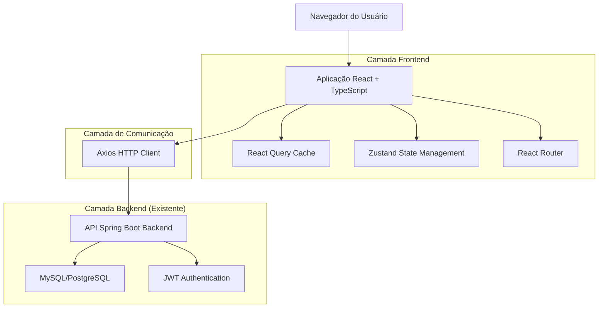
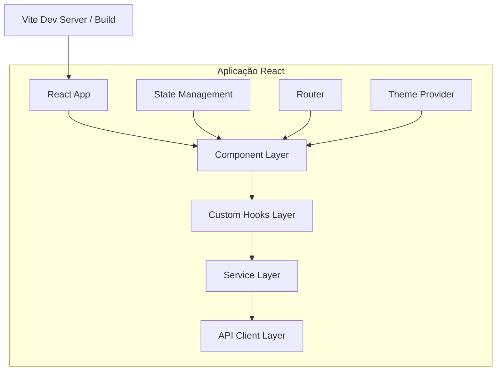
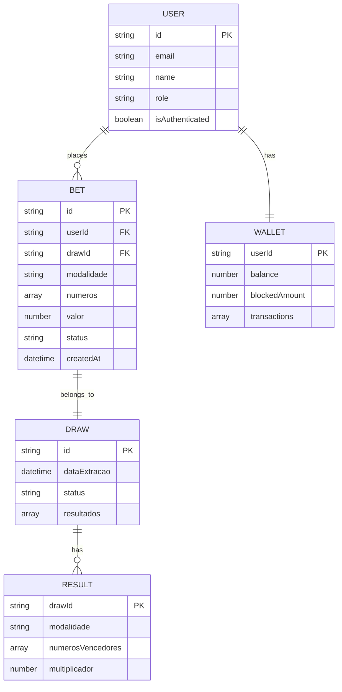

# 🏗️ Arquitetura Técnica - JBest Frontend

## 1. Arquitetura do Sistema



## 2. Descrição das Tecnologias

* **Frontend**: React\@18 + TypeScript\@5 + Vite\@5

* **Styling**: TailwindCSS\@3 + Headless UI + Framer Motion

* **State Management**: Zustand\@4 + React Query\@5

* **Routing**: React Router\@6

* **HTTP Client**: Axios\@1.6

* **Charts**: Chart.js\@4 + React-Chartjs-2

* **Forms**: React Hook Form\@7 + Zod validation

* **Icons**: Lucide React\@0.300

* **Build Tool**: Vite com plugins para PWA e bundle optimization

## 3. Definições de Rotas

| Rota             | Propósito                                             |
| ---------------- | ----------------------------------------------------- |
| /                | Página inicial com modalidades e status das extrações |
| /login           | Página de autenticação de usuários                    |
| /register        | Página de cadastro de novos usuários                  |
| /dashboard       | Dashboard principal do jogador com resumo financeiro  |
| /bet             | Interface de apostas com seleção de modalidades       |
| /bet/:modalidade | Página específica para cada tipo de aposta            |
| /wallet          | Carteira digital com transações e saldo               |
| /history         | Histórico completo de apostas do usuário              |
| /profile         | Perfil e configurações do usuário                     |
| /admin           | Dashboard administrativo (acesso restrito)            |
| /admin/users     | Gestão de usuários e permissões                       |
| /admin/reports   | Relatórios detalhados e exportação                    |
| /admin/draw      | Página de apuração de resultados                      |
| /admin/settings  | Configurações do sistema e parâmetros                 |

## 4. Definições de API

### 4.1 APIs Principais

**Autenticação de usuários**

```
POST /api/auth/login
```

Request:

| Nome do Parâmetro | Tipo   | Obrigatório | Descrição        |
| ----------------- | ------ | ----------- | ---------------- |
| email             | string | true        | Email do usuário |
| password          | string | true        | Senha do usuário |

Response:

| Nome do Parâmetro | Tipo    | Descrição                    |
| ----------------- | ------- | ---------------------------- |
| success           | boolean | Status da autenticação       |
| token             | string  | JWT token para autenticação  |
| user              | object  | Dados do usuário autenticado |

Exemplo:

```json
{
  "email": "usuario@jbest.com",
  "password": "senha123"
}
```

**Realizar aposta**

```
POST /api/bets
```

Request:

| Nome do Parâmetro | Tipo   | Obrigatório | Descrição                              |
| ----------------- | ------ | ----------- | -------------------------------------- |
| modalidade        | string | true        | Tipo de aposta (milhar, centena, etc.) |
| numeros           | array  | true        | Números selecionados                   |
| valor             | number | true        | Valor da aposta em reais               |
| extraçao\_id      | number | true        | ID da extração ativa                   |

Response:

| Nome do Parâmetro | Tipo    | Descrição            |
| ----------------- | ------- | -------------------- |
| success           | boolean | Status da aposta     |
| bet\_id           | string  | ID único da aposta   |
| comprovante       | object  | Dados do comprovante |

**Consultar saldo da carteira**

```
GET /api/wallet/balance
```

Response:

| Nome do Parâmetro   | Tipo   | Descrição                        |
| ------------------- | ------ | -------------------------------- |
| saldo\_atual        | number | Saldo disponível em reais        |
| saldo\_bloqueado    | number | Valor em apostas pendentes       |
| ultima\_atualizacao | string | Timestamp da última movimentação |

**Histórico de apostas**

```
GET /api/bets/history
```

Query Parameters:

| Nome do Parâmetro | Tipo   | Obrigatório | Descrição                 |
| ----------------- | ------ | ----------- | ------------------------- |
| page              | number | false       | Página da paginação       |
| limit             | number | false       | Itens por página          |
| modalidade        | string | false       | Filtro por modalidade     |
| data\_inicio      | string | false       | Data inicial (YYYY-MM-DD) |
| data\_fim         | string | false       | Data final (YYYY-MM-DD)   |

## 5. Arquitetura do Servidor Frontend



## 6. Modelo de Dados (Frontend State)

### 6.1 Definição do Modelo de Estado



### 6.2 Estruturas de Estado TypeScript

**Interface do Usuário**

```typescript
interface User {
  id: string;
  email: string;
  name: string;
  role: 'jogador' | 'admin' | 'operador';
  isAuthenticated: boolean;
  createdAt: string;
}
```

**Interface da Carteira**

```typescript
interface Wallet {
  userId: string;
  balance: number;
  blockedAmount: number;
  transactions: Transaction[];
  lastUpdated: string;
}

interface Transaction {
  id: string;
  type: 'deposito' | 'retirada' | 'aposta' | 'premio';
  amount: number;
  status: 'pendente' | 'aprovado' | 'rejeitado';
  createdAt: string;
  description?: string;
}
```

**Interface da Aposta**

```typescript
interface Bet {
  id: string;
  userId: string;
  drawId: string;
  modalidade: 'milhar' | 'centena' | 'dezena' | 'terno' | 'milhar_pura' | 'grupo';
  numeros: number[];
  valor: number;
  multiplicador: number;
  status: 'ativa' | 'vencedora' | 'perdedora' | 'cancelada';
  premio?: number;
  createdAt: string;
}
```

**Interface da Extração**

```typescript
interface Draw {
  id: string;
  dataExtracao: string;
  horarioLimite: string;
  status: 'aberta' | 'fechada' | 'apurada';
  resultados: DrawResult[];
  totalApostado: number;
  totalPremios: number;
  lucroLiquido: number;
}

interface DrawResult {
  modalidade: string;
  numerosVencedores: number[];
  multiplicador: number;
  quantidadeGanhadores: number;
  valorTotalPremios: number;
}
```

**Store Zustand Principal**

```typescript
interface AppState {
  // Auth State
  user: User | null;
  isLoading: boolean;
  
  // Wallet State
  wallet: Wallet | null;
  
  // Betting State
  activeDraw: Draw | null;
  currentBet: Partial<Bet> | null;
  
  // UI State
  theme: 'light' | 'dark';
  sidebarOpen: boolean;
  notifications: Notification[];
  
  // Actions
  login: (credentials: LoginCredentials) => Promise<void>;
  logout: () => void;
  updateWallet: (wallet: Wallet) => void;
  placeBet: (bet: Omit<Bet, 'id' | 'createdAt'>) => Promise<void>;
  toggleTheme: () => void;
}
```

