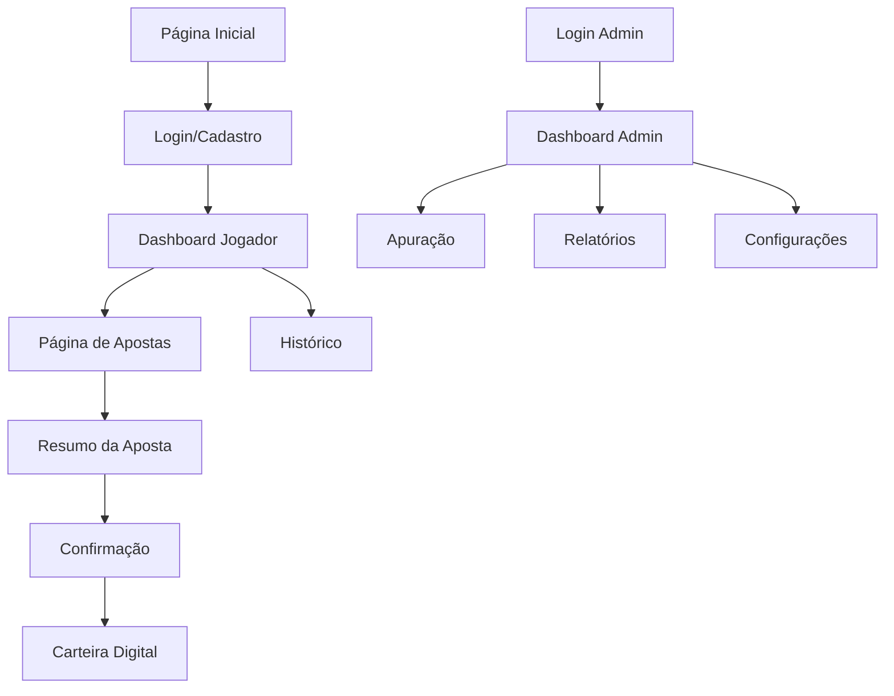

# 📱 PRD - JBest Frontend (Plataforma de Apostas Online)

## 1. Visão Geral do Produto

O **JBest Frontend** é uma aplicação web moderna e responsiva para apostas no jogo do bicho, desenvolvida em React com TypeScript. A plataforma oferece uma experiência fluida e intuitiva para apostadores, com interface otimizada para dispositivos móveis e desktop, garantindo rapidez, segurança e facilidade de uso.

- **Objetivo Principal**: Proporcionar uma experiência de apostas online moderna, rápida e segura, com foco na usabilidade móvel e desktop.
- **Público-Alvo**: Apostadores que buscam praticidade e administradores que necessitam de controle financeiro completo.
- **Valor de Mercado**: Plataforma escalável para até 10.000 usuários simultâneos com tempo de resposta inferior a 2 segundos.

## 2. Funcionalidades Principais

### 2.1 Perfis de Usuário

| Perfil | Método de Registro | Permissões Principais |
|--------|-------------------|----------------------|
| Jogador | Email + senha | Realizar apostas, gerenciar carteira, consultar histórico |
| Administrador | Credenciais administrativas | Dashboard completo, relatórios, gestão financeira |
| Operador | Convite do administrador | Apoio operacional, relatórios básicos, arrecadação |

### 2.2 Módulos de Páginas

Nossa plataforma JBest consiste nas seguintes páginas principais:

1. **Página Inicial**: hero section com modalidades, navegação principal, status das extrações.
2. **Página de Login/Cadastro**: autenticação segura, recuperação de senha, validação em tempo real.
3. **Dashboard do Jogador**: saldo da carteira, apostas ativas, histórico, próximas extrações.
4. **Página de Apostas**: seleção de modalidades, interface numérica, resumo da aposta.
5. **Carteira Digital**: depósitos, retiradas, histórico de transações, saldo em tempo real.
6. **Histórico de Apostas**: apostas anteriores, resultados, ganhos/perdas, filtros avançados.
7. **Dashboard Administrativo**: visão financeira completa, relatórios, gestão de usuários.
8. **Página de Apuração**: inserção de resultados, cálculo automático de prêmios, resumo financeiro.
9. **Configurações do Sistema**: horários de extração, limites de apostas, parâmetros operacionais.
10. **Relatórios Detalhados**: consultas avançadas, exportação de dados, gráficos interativos.

### 2.3 Detalhes das Páginas

| Página | Módulo | Descrição da Funcionalidade |
|--------|--------|-----------------------------|
| Página Inicial | Hero Section | Exibir modalidades disponíveis, próximas extrações, status do sistema |
| Página Inicial | Navegação Principal | Menu responsivo, acesso rápido às funcionalidades, indicador de saldo |
| Login/Cadastro | Formulário de Autenticação | Validação em tempo real, recuperação de senha, autenticação JWT |
| Dashboard Jogador | Resumo Financeiro | Saldo atual, últimas apostas, próximas extrações, notificações |
| Dashboard Jogador | Ações Rápidas | Botões para nova aposta, depósito, histórico, configurações |
| Página de Apostas | Seleção de Modalidades | Interface com cards para Milhar, Centena, Dezena, Terno, Milhar Pura, Grupo |
| Página de Apostas | Interface Numérica | Teclado virtual, seleção múltipla, validação de entrada, preview da aposta |
| Página de Apostas | Resumo da Aposta | Confirmação de valores, multiplicadores, cálculo de ganhos potenciais |
| Carteira Digital | Gestão de Saldo | Visualização em tempo real, histórico de movimentações, alertas |
| Carteira Digital | Transações | Depósitos manuais, solicitação de retiradas, status de aprovação |
| Histórico | Lista de Apostas | Filtros por data/modalidade, status de cada aposta, resultados |
| Dashboard Admin | Visão Financeira | Gráficos interativos, métricas em tempo real, resumo de lucros |
| Dashboard Admin | Gestão de Usuários | Lista de jogadores, bloqueios, permissões, atividade recente |
| Apuração | Inserção de Resultados | Interface para digitação de milhares, cálculo automático de prêmios |
| Apuração | Resumo da Extração | Quantidade de apostas, total arrecadado, prêmios pagos, lucro líquido |
| Configurações | Parâmetros do Sistema | Horários de extração, limites de apostas, multiplicadores |
| Relatórios | Consultas Avançadas | Filtros personalizados, exportação PDF/Excel, gráficos dinâmicos |

## 3. Fluxo Principal de Usuário

**Fluxo do Jogador:**
1. Acesso à página inicial → visualização das modalidades disponíveis
2. Login/cadastro → autenticação segura
3. Dashboard → verificação de saldo e próximas extrações
4. Seleção de modalidade → escolha do tipo de aposta
5. Inserção de números → interface intuitiva de seleção
6. Confirmação da aposta → resumo e validação
7. Acompanhamento → histórico e resultados

**Fluxo do Administrador:**
1. Login administrativo → dashboard financeiro
2. Monitoramento em tempo real → apostas ativas
3. Apuração de resultados → inserção de milhares
4. Análise de relatórios → consultas detalhadas
5. Gestão de usuários → controle de permissões

## 4. Design da Interface do Usuário

### 4.1 Estilo de Design

- **Cores Primárias**: #1E40AF (azul profundo), #10B981 (verde sucesso), #EF4444 (vermelho alerta)
- **Cores Secundárias**: #F8FAFC (fundo claro), #1F2937 (texto escuro), #6B7280 (texto secundário)
- **Estilo de Botões**: Rounded corners (8px), gradientes sutis, estados hover/active bem definidos
- **Tipografia**: Inter (títulos), Roboto (corpo), tamanhos 14px-32px com hierarquia clara
- **Layout**: Design card-based, navegação superior fixa, sidebar responsiva para admin
- **Ícones**: Lucide React icons, estilo outline, tamanho consistente 20-24px

### 4.2 Visão Geral do Design das Páginas

| Página | Módulo | Elementos de UI |
|--------|--------|----------------|
| Página Inicial | Hero Section | Gradient background, cards de modalidades com hover effects, countdown timer para próxima extração |
| Dashboard Jogador | Resumo Financeiro | Cards com sombras sutis, gráficos em donut para distribuição de apostas, cores verde/vermelho para ganhos/perdas |
| Página de Apostas | Interface Numérica | Grid 3x4 para números, botões com feedback tátil, preview em tempo real da aposta |
| Carteira Digital | Transações | Lista com ícones de status, filtros dropdown, botões de ação primários destacados |
| Dashboard Admin | Gráficos | Charts.js integrado, paleta de cores consistente, tooltips informativos |

### 4.3 Responsividade

- **Mobile-first**: Design otimizado para dispositivos móveis com breakpoints em 768px e 1024px
- **Touch-friendly**: Botões com área mínima de 44px, gestos de swipe para navegação
- **Adaptação de layout**: Sidebar colapsável, navegação bottom-tab em mobile, modais full-screen em telas pequenas
- **Performance**: Lazy loading de imagens, code splitting por rotas, otimização de bundle size